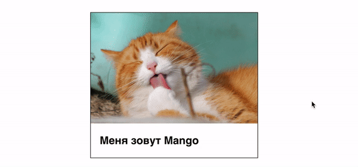

# Домашнее задание

- Создай репозиторий `goit-markup-hw-05`.
- Склонируй новый репозиторий и перенеси в него файлы четвёртой работы.
- Добавь оформление всех декоративных эффектов для страниц `Студия` и
  `Портфолио` из макета
  [домашнего задания #5](<https://www.figma.com/file/VQ02IIL57fc33U4GP1WEdf/Web-Studio-(Version-2.0)?node-id=1599%3A336>).
- Настрой `GitHub Pages` и добавь ссылку на живую страницу в шапку
  GitHub-репозитория.

## Критерии приёма работы

[Основные критерии прёма работы](./criteria.md)

### Дополнительные критерии

- Создан репозиторий `goit-markup-hw-05`.
- Для всех эффектов ховера и фокуса сделаны переходы. Время - `250ms`, функция
  распределения времени - `cubic-bezier(0.4, 0, 0.2, 1)`.
- В главной навигации, при помощи псевдоэлемента, сделано подчёркивание текущей
  ссылки.
- В секции `Чем мы занимаемся` текст спозиционирован поверх изображения.
- В секции `Портфолио`, синий оверлей с текстом поверх изображения выезжает
  снизу изображения, как показано на видео ниже.



#### Модальное окно

- Есть разметка и оформление модального окна и его бекдропа (тёмного
  полупрозрачного фона).
- Изначально модальное окно скрыто при помощи класса `is-hidden` (свойства
  visibility, opacity и pointer-events). Если класс убрать - модалка появляется.
- Появление и скрытие модального окна анимированы при помощи перехода с
  произвольным эффектом, например `scale` или `translate`, и `opacity`.

## Открытие модального окна (не обязательно)

Модальное окно с формой заявки открывается по клику на **кнопку**
`"Заказать услугу"`. Для того чтобы скрипт сработал необходимо добавить в
разметку специальные атрибуты, по которым скрипт ищет элементы:

- `data-modal-open` - на кнопку открытия модального окна
- `data-modal-close` - на кнопку закрытия модального окна
- `data-modal` - на бекдроп модального окна

После чего, перед закрывающим тегом `body` добавить тег `script` со ссылкой на
файл скрипта для модально окна. Можно посмотреть
[видеоинструкцию](https://drive.google.com/file/d/1yasixN2K-9DdsYtKCJWVay9WbyTZai0t/view?usp=sharing).

```html
<body>
  <!-- Вся твоя разметка, включая разметку модалки -->

  <!-- Ставим перед закрывающим тегом body -->
  <script src="./js/modal.js"></script>
</body>
```

Вот скрипт который необходимо скопировать и вставить в файл скрипта `modal.js`.

```js
(() => {
  const refs = {
    openModalBtn: document.querySelector('[data-modal-open]'),
    closeModalBtn: document.querySelector('[data-modal-close]'),
    modal: document.querySelector('[data-modal]'),
  };

  refs.openModalBtn.addEventListener('click', toggleModal);
  refs.closeModalBtn.addEventListener('click', toggleModal);

  function toggleModal() {
    refs.modal.classList.toggle('is-hidden');
  }
})();
```
