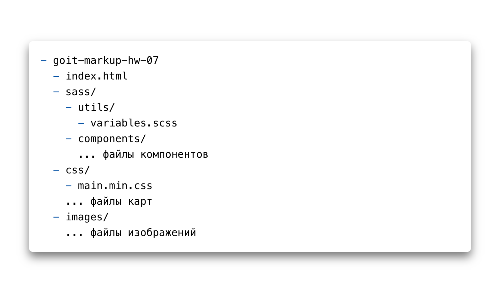

# Домашнее задание

- Создай репозиторий `goit-markup-hw-07`.
- Склонируй созданный репозиторий и скопируй в него файлы предыдущей работы.
- Настрой `GitHub Pages` и добавь ссылку на живую страницу в шапку
  GitHub-репозитория.

## Структура файлов проекта

## Критерии приёма работы наставником

## Проект

**`«A1»`** Выполнен рефакторинг HTML-кода проекта используя методологию BEM.

**`«A2»`** Выполнен рефакторинг CSS-кода проекта используя препроцессор `SASS`.

**`«A3»`** В корне проекта создана папка `sass`, в которой лежат все файлы
стилей препроцессора.

**`«A4»`** В папке `sass` есть файл `main.scss` - главный файл в котрый
импортируются все SASS-фрагменты (partials, файлы `_имя.scss`).

**`«A5»`** Палитра цветов макета и наборы шрифтов вынесены в переменные в файле
`variables.scss`, который лежит в папке `sass/utils`. Можно использовать CSS или
SASS переменные (по желанию).

**`«A6»`** Для каждого компонента создан отдельный файл-фрагмент стилей в папке
`sass/components`. Напримпер `_page-header.scss`, `_logo.scss` и т. д.

**`«A7»`** В файлах `index.html` и `portfolio.html` подключен минифицированный
файл стилей `main.min.css` из папки `css`.

## Разметка

**`«B1»`** Правильное именование классов блоков по методологии BEM.

**`«B2»`** Правильное именование классов элементов по методологии BEM.

**`«B3»`** Правильное именование классов модификаторов по методологии BEM.

**`«B4»`** Правильное именование классов примесей по методологии BEM.

**`«B5»`** Имена классов по методологии BEM понятные и описательные, на
английском языке.

## Оформление

**`«C1»`** Использована вложенность селекторов.

**`«C2»`** Максимальная вложенность селекторов - 2 уровня.

**`«C3»`** Оператор конкатенации (`&`) использован для описания псевдоклассов и
псевдоэлементов.
