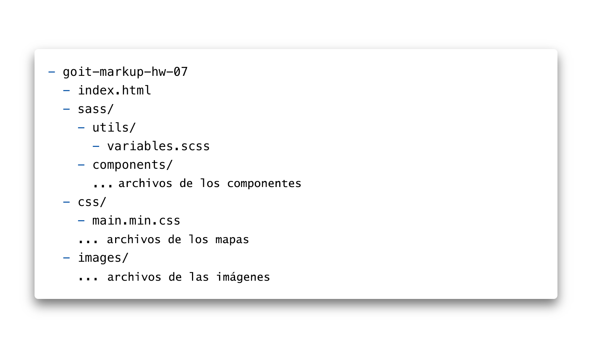

**Read in other languages: [Russian](README.md), [Ukrainian](README.ua.md),
[English](README.en.md), [Spanish](README.es.md), [Polish](README.pl.md).**

# Tarea

- Cree el repositorio `goit-markup-hw-07`.
- Clone el repositorio creado y copie los archivos de trabajo anteriores en él.
- Configure las `GitHub Pages` y agregue un enlace a la página en vivo en el
  encabezado del repositorio de GitHub.

## Estructura de archivos del proyecto

## Los criterios de aceptación de trabajo por parte del tutor

### El proyecto

**`«A1»`** La refactorización del código HTML del proyecto se realiza utilizando
la metodología BEM.

**`«A2»`** La refactorización del código CSS del proyecto se realiza utilizando
el preprocesador `SASS`.

**`«A3»`** En la raíz del proyecto, hay una carpeta `sass`, que contiene todas
las hojas de estilo del preprocesador.

**`«A4»`** En la carpeta `sass` hay archivo `main.scss` - el archivo principal
en el que se importan todos los fragmentos de SASS (partials, archivos
`_nombre.scss`).

**`«A5»`** La paleta de colores de diseño y los conjuntos de fuentes se
presentan como variables en el archivo `variables.scss`, en la carpeta
`sass/utils`. Se pueden utilizar variables CSS o SASS (opcionalmente).

**`«A6»`** Para cada componente, se crea una hoja de estilo de fragmentos
separada en la carpeta `sass/components`. Por ejemplo `_page-header.scss`,
`_logo.scss` y etc.

**`«A7»`** En los archivos `index.html` y `portfolio.html` hay un archivo de
estilo minificado enlazado `main.min.css` de la carpeta `css`.

## El marcado

**`«B1»`** Nomenclatura adecuada de clases de bloques según la metodología BEM.

**`«B2»`** Nomenclatura adecuada de clases de elementos según la metodología
BEM.

**`«B3»`** Nomenclatura adecuada de clases de modificadores según la metodología
BEM.

**`«B4»`** Nomenclatura adecuada de clases 'mixin' según metodología BEM.

**`«B5»`** Los nombres de las clases de BEM son claros y descriptivos, todos son
en inglés.

## El diseño

**`«C1»`** Se utiliza el selector de anidamiento.

**`«C2»`** La anidación máxima de los selectores es de 2 niveles.

**`«C3»`** El operador de concatenación (`&`) e usa para describir pseudo-clases
y pseudo-elementos.
